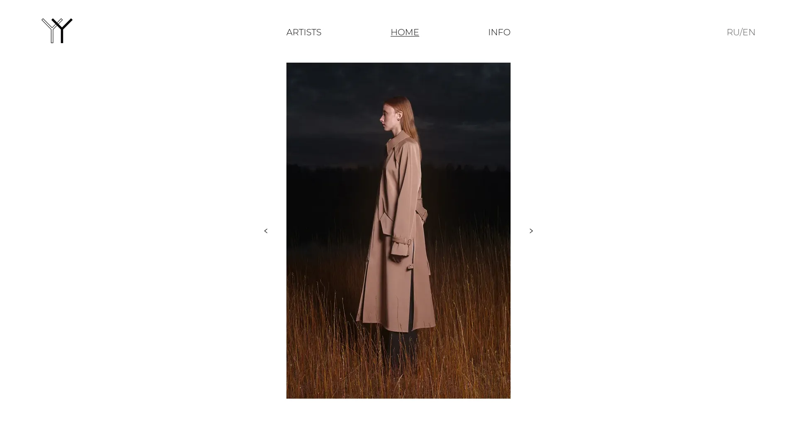

# YY



## Getting Started

Run the development server:

```bash
sudo docker-compose -f docker/docker-dev.yml --project-directory . up --build
```

Run the production server:

```bash
sudo docker-compose -f docker/docker-prod.yml --project-directory . up --build
```

Open [http://localhost:3000](localhost:3000) with your browser to see the result.

## Authors

-   Ivan Reshetnikov <ordinarydev@protonmail.com>
